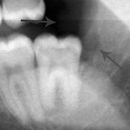
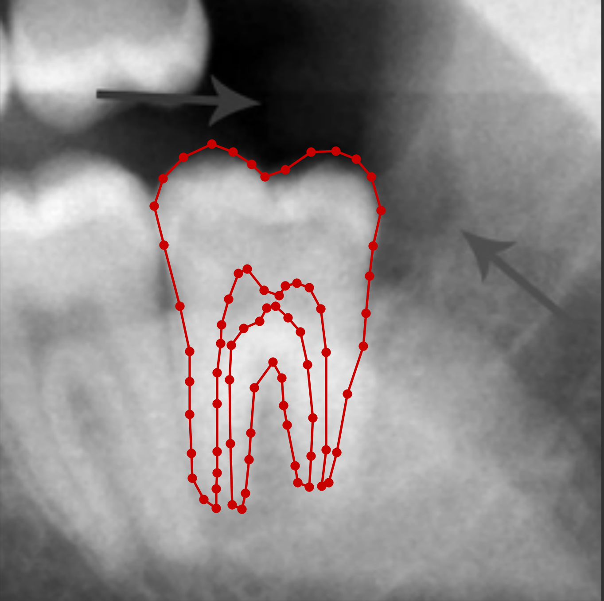
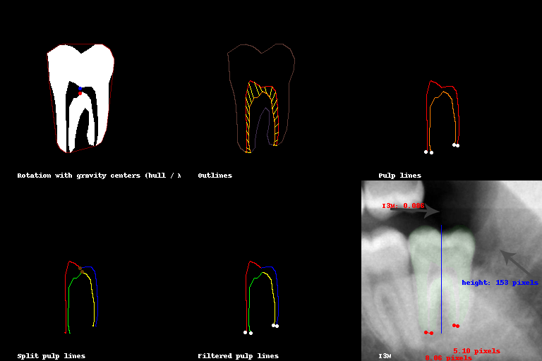

# Apex points

The goal of this project is to find the position of apices using dentin masks.
See [labelme](https://github.com/wkentaro/labelme) for an overview of this tool, used to make the segmentations.

## Example

Below are images of the produced images from [this tooth example](https://upload.wikimedia.org/wikipedia/commons/thumb/c/c5/38_pericornitis_xray.jpg/640px-38_pericornitis_xray.jpg).

### Initial image

### Segmentation

### Produced output

